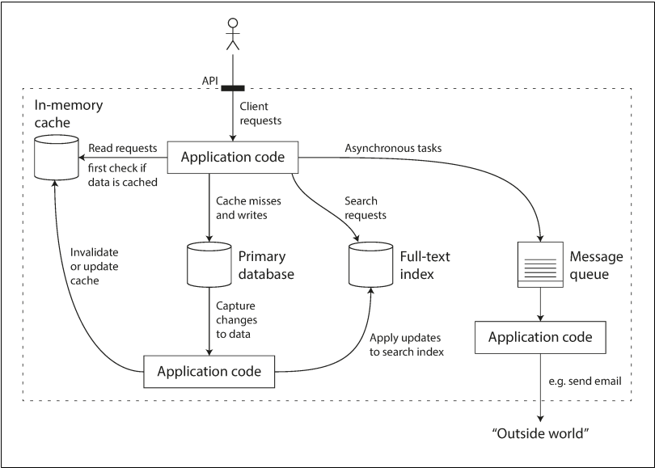

# Reliable, scalable and maintainable Applications

Data Intensive applications
- Amount of data
- Complexity of data
- Speed at which data is changing

Building blocks
- databases - Store Data 
- caches - remember result of compute intensive operation
- search indexes - faceted, keyword based full/free text search
- stream processing - async message passing
- batch processing - offline data crunching
    
> **Note** - Application code is glue that stitches special purpose data systems which connects general-purpose smaller components

